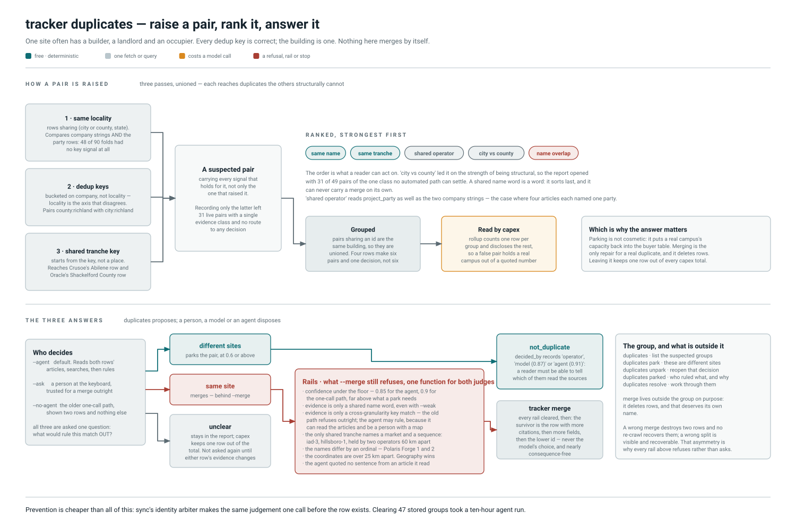

# `tracker duplicates` and its subcommands

> Rows that look like one campus stored several times.

One site often has a builder, a landlord and an occupier, and whichever name a
source picks becomes its own row with its own dedup key. Every key is correct; the
building is one.

Bare `tracker duplicates` and `duplicates parked` are **read-only**. `park`,
`unpark` and `resolve` write and take the single-writer lock, so per `CLAUDE.md` §2
they run on the production host.

## How a pair is raised

Three passes over the same rows, **unioned rather than substituted**. Each reaches
duplicates the others structurally cannot, and the measurements are the argument:

| | Starts from | Reaches |
| --- | --- | --- |
| 1 | the `(city or county, state)` bucket | the same-locality, different-company case that made `capex` need this at all. Finds 230 pairs live |
| 2 | dedup keys, bucketed on **company** — locality is the axis that disagrees | cross-granularity duplicates: Hyperion stored four times as `richland parish`, `holly ridge`, `richland`, `richmond parish`. Finds 259 pairs, but alone would **lose 225 of pass 1's 230** |
| 3 | a shared tranche key, not a place | a campus filed under two locality names that do not match — Stargate as Crusoe's `abilene` row and Oracle's `shackelford county` row. Nine pairs, seven of them real |

Every pass records **every** signal that holds for the pair, not only the one that
raised it. Pass 2 once recorded `shared_keys` and nothing else, which left 31 live
pairs carrying a single evidence class and no route to any decision — 12 of them
also shared a distinctive name token, 8 a real tranche key, and 6 were
byte-identical in name and company.

## The evidence classes, and why the order changed

`EVIDENCE_ORDER`, strongest first. They are not equal — a shared tranche is two
readings of one building, a shared operator is how one campus becomes four rows,
and a shared name word is a word.

| Class | Label | Carries a merge? |
| --- | --- | --- |
| `exact` | same name | yes |
| `tranche` | same tranche | yes, unless the key is a market sequence |
| `party` | shared operator | yes |
| `identity` | city vs county | only via the agent, never the one-call path |
| `name` | name overlap | never |

`identity` used to lead the list on the strength of being structural, so the report
opened with 31 of its 49 pairs — every one a class no automated path can settle.
The classes something can be *done* about now sort first.

A shared word also had to get stricter. `Aligned Data Centers Phoenix` and
`NTT Global Data Centers Americas Phoenix` were reported as one campus on the token
"centers", because the generic list held the singular and not the plural. A tranche
key that turns up in more than one town is vocabulary, not identity, and no longer
pairs anything.

## Why the answer matters more than the report

`capex.rollup` reads the same suspected pairs and holds one row of every group out
of the buyer table, disclosed in the `*_skipped` fields. So a false pair does not
merely clutter a listing — **it takes a real campus's capacity out of a number
somebody quotes**, until a person rules it out. That is the whole reason parking
exists, and why a parked pair is *gone* from `suspected_duplicates` rather than
merely marked.

Pairs sharing an id are transitively the same building and are unioned into groups,
so four rows for one site are one decision rather than six.

## The subcommands

| | Writes | Does |
| --- | --- | --- |
| `duplicates` | no | lists the suspected groups. `--no-weak` drops the name-word-only pairs; `--parked` shows the ruled-out ones instead |
| `duplicates park A B …` | yes | records that these are different sites. Every pair among the ids is stored separately, so a third row appearing next week is still asked about |
| `duplicates unpark A B …` | yes | the exact inverse, including its shape |
| `duplicates parked` | no | every pair ruled out, with `decided_by` and the reason |
| `duplicates resolve` | yes | works through them with a model |

`tracker merge` lives **outside** the group on purpose: it deletes rows, and that
deserves its own name.

`park` and `unpark` take two or more ids because parking is a statement about a
*pair*; one id is refused. Nothing is edited or deleted either way.

## `duplicates resolve`

`duplicates` proposes and never disposes, which is right — a wrong merge destroys
two rows and no re-crawl recovers them. The cost of that caution was a report nobody
answered: 30 live pairs, 29 across genuinely different company names, each waiting
on a person to open two rows and read their citations.

### Which judge

| Flag | Judge | Recorded as |
| --- | --- | --- |
| `--agent` (default) | reads both rows' articles, searches if it must, then rules | `agent (0.91)` |
| `--ask` at a terminal | a person, trusted for a merge without the confidence floor | `operator` |
| `--no-agent` | the older one-call path, shown two rows and nothing else | `model (0.87)` |

`--ask` suppresses the agent: paying for a run whose answer is then overridden at
the keyboard buys nothing. `--no-llm` suppresses it too — the agent *is* a model, so
"no model" has to mean no model, or `--no-llm --no-ask` would spend calls instead of
saying that nothing can decide.

### Three answers, trusted unequally

* **different** parks the pair, with the evidence classes travelling in the reason.
  Reversible by `unpark`, and it is the useful half: it puts a real campus's
  capacity back into the buyer table.
* **same** merges, but only with `--merge` and only past every rail below.
* **unclear** leaves the pair in the report, which is a real answer.

### What `--merge` still refuses

Every branch is a rule stated elsewhere in the codebase, restated as a refusal the
run prints per pair. The poster lists all seven; the two worth expanding:

* **A cross-granularity key match alone.** `dedup.py`'s founding invariant: a
  county-level row and a city-level row are never merged automatically, because no
  string comparison can tell whether "Racine County, WI" and "Mount Pleasant, WI"
  are one project. The **agent path drops this one**, and that is deliberate — a
  model shown two rows and nothing else is not a person with a map, but one that can
  read the articles and search can be, and 28 of 47 live groups are exactly this
  shape, with the model already reasoning containment unprompted.
* **Ordinal siblings.** `Polaris Forge 1` in Ellendale and `Polaris Forge 2` in
  Harwood both hold `forge-2.polaris`, because one article listed the pair. Two real
  campuses, every signal in agreement, one digit between them.

Geography outranks the model in both paths: two rows with real coordinates more
than `FAR_APART_KM` apart are not one site whatever it concluded, because that is a
fact check rather than a menu.

### Which row survives

Not the model's choice. The row with more citations, then more fields filled, then
the lower id — deterministic, so the same input gives the same answer. It is also
nearly consequence-free: `merge_projects` recomputes every field from the combined
claims, so this decides a row number rather than a value.

`folded` carries a run's merges forward, so a later pair naming a row this run just
deleted is asked about the survivor instead. That is what settles a group of four
in one pass rather than one merge per run.

### Writability under `--dry-run`

`resolve --dry-run` still opens the database **writable** and still takes the write
lock, exactly as `tracker merge --dry-run` does. The run parks and merges inside a
transaction and the dry run is that transaction not being committed; a `mode=ro`
connection cannot even hold those writes long enough to describe them. The model
calls are paid for either way, which is the honest way to see what a run would do.

## Prevention beats all of it

A duplicate created at ingest costs, in order: a row nobody wanted; one side of the
pair held out of every `capex` total until somebody settles it; then either a person
reading two sets of citations or a merge that deletes a row and cannot be undone.
Measured here: 47 suspected groups holding 22,012 MW twice, and clearing most of
them took a ten-hour agent run.

The same judgement made *before* the insert costs one call and deletes nothing —
that is [`sync`'s identity arbiter](sync.md#the-identity-arbiter). It now rules from
the article extraction already read, rather than fetching it again, and is handed the
suspected row's full details so it answers the same question `resolve` asks here, one
call earlier and with nothing yet to undo.

## Source map

Touching any of these means the poster is in scope. Re-render with
`python scripts/render_workflow_diagrams.py duplicates`.

| Concern | Where |
| --- | --- |
| The three detection passes | `tracker/capex.py` — `suspected_duplicates` |
| Evidence classes, labels, ranking | `tracker/capex.py` — `EVIDENCE_ORDER`, `EVIDENCE_LABELS`, `strongest_evidence`, `DuplicatePair.rank` |
| Grouping and the MW figure | `tracker/capex.py` — `duplicate_groups`, `double_counted_mw` |
| Key comparison primitives | `tracker/dedup.py` — `all_keys`, `is_cross_granularity_match`, `is_market_sequence`, `sibling_ordinals`, `exact_identity`, `shared_parties_across_companies` |
| Parking | `tracker/pairs.py` — `park`, `unpark`, `listing`, `parked_keys`, `canonical` |
| The one-call path and its rails | `tracker/dupresolve.py` — `resolve`, `resolve_one`, `merge_blocked`, `survivor`, `ask_model`, `MERGE_CONFIDENCE`, `FAR_APART_KM` |
| The agent path | `tracker/triage.py` — `resolve_pairs`, `pair_triage`, `pair_verdict_tools`, `PAIR_SYSTEM` |
| The merge itself | `tracker/merge.py` — `merge_projects` |
| Prevention at write time | `tracker/gatekeeper.py` — `same_site_arbiter`, `_warm_verdict`, `_cold_verdict`, `_rejection`, `RULES`; `tracker/ingest/crawl.py` — `ExtractionContext` |
| CLI, printers, keyboard prompt | `tracker/cli.py` — `duplicates`, `duplicates_park`, `duplicates_unpark`, `duplicates_resolve`, `duplicates_parked`, `_print_parked`, `_dupe_prompt` |
