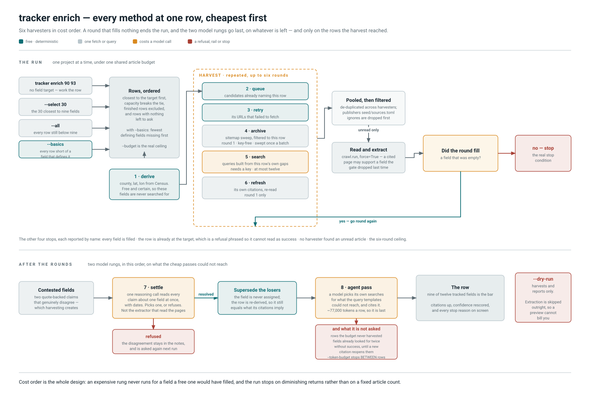

# `tracker enrich`

> Throw every retrieval method at one or more projects until rounds stop paying.

`tracker sync` spreads a budget across the whole database and grows it sideways.
`enrich` does the opposite: it drives chosen rows towards the PRD's bar of nine
filled fields out of twelve, using six harvesters cheapest-first so an expensive
method never runs for a field a free one would have filled.

It **writes**, it takes the single-writer lock, and per `CLAUDE.md` §2 it runs on
the production host:

```bash
ssh $PROD 'tracker enrich --select 30'
```



## Choosing rows

Three mutually exclusive entry points. Passing two is an error rather than a
precedence rule.

| | Chooses | `--target` default |
| --- | --- | --- |
| `tracker enrich 90 93` | exactly those ids | **0, meaning no target.** Naming a row is an instruction to work on it; a 9-field target turned `enrich 10` into a no-op that first fetched 22 sitemaps |
| `tracker enrich --select 30` | 30 rows, closest to target first | 9 (`DEFAULT_TARGET_FIELDS`) |
| `tracker enrich --all` | every row below target, same order | 9 |
| `tracker enrich --basics` | every row short of a field that *defines* it, fewest gaps first | none — `--budget` bounds it |

`select_projects` orders by fields already filled, descending, then by planned
capacity. Closest-first converts the most rows per call: 8 to 9 fields costs one
article, 4 to 9 may never arrive. `--all` is not unbounded spend — `--budget` is
the real ceiling, and the ordering decides who is served before it runs dry.

## `--basics`: the fields that say what a project is

A modifier rather than a fourth way of choosing rows — it changes which *fields* are
chased, so it composes with all three entry points. Alone it also picks the rows.

| Flag | Cost | What it does |
| --- | --- | --- |
| `--basics` | the cheapest mode | Chases the eight fields that define a row: `name`, `company`, `state`, `country`, `phase`, `mw_planned`, `mw_built`, `expected_online`. The agent is asked about four of them instead of eight, and search queries narrow to match |
| `--fields a,b` | narrower still | An explicit list. Refuses anything outside `gapfill.FILLABLE_FIELDS`, naming the choices |
| `--token-budget N` | a ceiling, not a cap | Stops the agent pass **between** rows. `0` (default) means no limit |
| `--max-attempts N` | compounding | Stops asking about a field after N fruitless tries. Default 2; `0` asks every time |

**Presence alone could not be the check.** `name`, `company`, `state`, `country` and
`phase` are `NOT NULL`, and `ck_project_locality` forces a city or a county, so a
scan for *missing* basics returns nothing. The condition therefore asks two
questions: whether the three nullable fields are there, and whether the values rest
on a citation rather than on a schema default. A row whose `phase` nobody ever
stated reads `announced` and presents it as though a source had said so —
`gaps.provenance` has called that `DEFAULTED` all along and nothing acted on it.

`country` is deliberately exempt from the provenance half. No article about a campus
in Ohio says it is in the United States, so `US` arrives by default on essentially
every row and is *correct*; demanding a citation would fail the whole database for
being right. The hand-cleaned reference row caught that the first time it was asked.

**See the size of the job before paying for any of it.** `tracker clean` reports the
same condition as `basics_defined`, free, read-only and without the write lock. It is
reported but is **not** a tier condition, following `capex.suspected_duplicates`:
adding one moves every row's tier in a single commit and buries the signal it exists
to raise.

## The six harvesters

`derive` is stage 1 and sits outside the round loop. The other five run inside it,
and `Harvest.skipped` is what puts "search unavailable" on screen rather than in a
debug log.

| | Cost | Runs | Draws on |
| --- | --- | --- | --- |
| derive | free, no network | once, before round 1 | Census reference data |
| queue | free | every round | `ingest_url` rows still `discovered` |
| retry | one fetch each | every round | this project's URLs in `RETRYABLE_STATUSES` |
| archive | ~30 requests, once per batch | round 1 only | configured `[[sitemap]]` entries |
| search | one query each, capped at `MAX_QUERIES` = 12 | every round | Serper / Google / Brave / Bocha |
| refresh | one fetch each | round 1 only | the project's own citations |

The archive is why this works without a search API: it reaches back years, needs no
key, and `matches_known_project` reduces thousands of URLs to the handful about one
project.

## Why a round stops

Seven reasons, each reported verbatim as `stopped_because`. Two are worth knowing:

* **"a full round filled nothing new"** is the real stop condition. "Cost no
  object" means bounded by diminishing returns; `--max-rounds` and `--max-articles`
  exist only so a bug cannot spend without limit.
* **"nothing harvested — already holds N of the 12 tracked fields"** is a refusal
  to work, phrased so it cannot be misread as an accomplishment. It names the flags
  that override it.

## Budget arithmetic

`--budget` (default 200) is the whole run's article count, not per project.
`run_many` divides it: `fair_share = budget / len(project_ids)`, and each project
gets `min(--max-articles, fair_share)` per round. Measured before that division, a
budget of 120 across thirty projects was consumed by the first five and twenty-five
never ran — the run is judged on how many rows clear the bar, so every selected
project gets a turn.

## The settle stage

After the rounds, before the report. Harvesting sources is what *creates*
disagreement, so this is the moment the question arises and the claims are in hand.
Every still-contested field — not only the ones this run added — goes to
`conflicts.solve` on the **judgement** tier (the reasoning model at `high`, one call
per field), deliberately not the extractor that read the articles. It writes, unlike `tracker logic conflicts`, which proposes;
`--dry-run` suppresses the write along with everything else.

It needs no bookkeeping to avoid re-asking. Applying an answer marks the losing
claims `superseded`, which demotes them out of `confirmed`, and a dispute needs two
quote-backed claims — so a settled field stops being contested. A refusal writes
nothing and *is* re-asked, which is right: the sources have usually changed by then.

`LLMUnavailable` here is caught and reported as a skip rather than raised. The
harvest is already written, and losing it because the judgement tier has no key
would throw away every article the run paid to read.

## The agent pass

`--agent` (on by default) runs `gapfill.fill` per project **after** the harvest
rounds, committed per project so a provider failure on row 20 keeps the first 19.
It is the expensive rung — roughly 77,000 tokens a row against a few hundred for a
query template — so it is pointed only at the residue the templates could not
reach. Rows with nothing left to fill return before making a call. Refusals are
printed as loudly as fills: a refusal is the evidence gate working, and a run that
quietly dropped four facts of five should not look like one that stored all five.

**Three rails decide what it is not asked, and all three save by not calling.**

* **Only rows the harvest reached.** `run_many` stops when the article budget runs
  out and leaves the rest of the list untouched, but the pass was handed every id
  that had been *selected*. Measured on the shape that prompted this: `--all` over
  403 rows at `--budget 200` gives each row one article a round, exhausts the budget
  after roughly fifty of them, and then billed the agent for all 403 — about 85% of
  ~31M tokens spent on rows the cheap rung never opened.
* **Fields already looked for.** `tracker.attempts` records a fruitless asking in
  `project.notes`, the prose channel re-ingesting never erases, and `enrich` stops
  asking after `--max-attempts`. It is a cap, not a verdict: the record carries the
  citation count at the time, so a row that gains evidence reopens every field.
  `audit.settled_codes` documents what a decision that never expires costs.
* **`--token-budget`, between rows only.** Aborting a run in flight would spend the
  tokens and store nothing, which is the waste it exists to prevent rather than a
  way to prevent it. A budget too small for one row attempts nothing and says so.

## Two failures the comments record

Both invisible from the outside, and both shaped the current call:

* `cache_dir` was once absent from this call site alone, and a 36-hour `--all` run
  read ~3,000 articles while caching none. Three later steps read that cache rather
  than the network: `ingest crawl --stale-prompt`, `backfill blocks`, and
  `riskcheck.article_for`.
* The archive sweep once ran before anything asked whether it was needed, so
  `enrich 10` on a finished row fetched every configured sitemap and then declined
  to work. `will_harvest` mirrors the two conditions `run` breaks on, and lives
  beside them so a divergence is visible. The sweep also ran at `--budget 0`, where
  nothing is read; `run_many` skips it there now.

## Source map

Touching any of these means the poster is in scope. Re-render with
`python scripts/render_workflow_diagrams.py enrich`.

| Concern | Where |
| --- | --- |
| Options, defaults, target defaulting, lock | `tracker/cli/enrich.py` — `enrich` |
| Round loop and stop reasons | `tracker/ingest/enrich.py` — `run` |
| Batch budget, one-time sweep | `tracker/ingest/enrich.py` — `run_many`, `sweep_archives`, `will_harvest` |
| Row selection order | `tracker/ingest/enrich.py` — `select_projects`, `DEFAULT_TARGET_FIELDS` |
| Harvesters | `tracker/ingest/enrich.py` — `harvest_queue`, `harvest_retry`, `harvest_archive`, `harvest_search`, `harvest_refresh`, `_derive` |
| Ignore-list filtering | `tracker/ingest/enrich.py` — `Round.urls`; `tracker/policy.py` |
| Settle stage | `tracker/ingest/enrich.py` — `_settle`; `tracker/conflicts.py` — `disputes`, `solve`, `apply_outcome` |
| Agent pass | `tracker/cli/enrich.py` — `_gapfill_batch`; `tracker/gapfill.py` — `apply_facts`, `_basis_axes`, `Filled.missed` |
| The basic field set, and the free scan for it | `tracker/clean.py` — `BASIC_FIELDS`, `BASIC_SOURCED_FIELDS`, `basics_missing`, `basics_worklist`, `basic_fillable` |
| Not asking twice | `tracker/attempts.py` — `exhausted`, `record`, `evidence_count` |
| Parties and the megawatt basis | inherited: the harvesters run the crawl reader, so a citation from this command carries both. The agent pass builds its own citation and derives the basis itself (`gapfill._basis_axes`); its parties come from `parties._inferred_parties`, which reads any citation's own claims |
| Scoring and reporting | `tracker/ingest/enrich.py` — `report_score`, `EnrichReport`, `BatchReport`; `tracker/cli/enrich.py` — `_render_enrich`, `_render_batch` |

See also: [sync](sync.md), whose phase 5 is this command with `--enrich-budget` in
place of `--budget`; and [logic](logic.md), whose `conflicts` command is the settle
stage with `--apply` made explicit.
