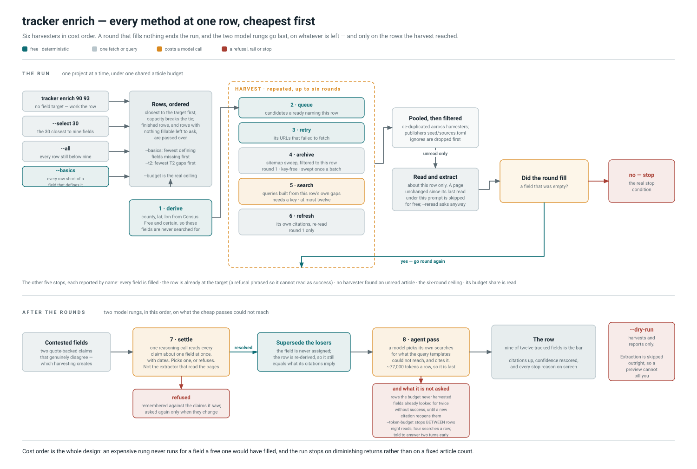

# `tracker enrich`

> Throw every retrieval method at one or more projects until rounds stop paying.

`tracker sync` spreads a budget across the whole database and grows it sideways.
`enrich` does the opposite: it drives chosen rows towards the PRD's bar of nine
filled fields out of twelve, using six harvesters cheapest-first so an expensive
method never runs for a field a free one would have filled.

It **writes**, it takes the single-writer lock, and per `CLAUDE.md` §2 it runs on
the production host:

```bash
ssh $PROD 'tracker enrich --select 30'
```



## Choosing rows

Three mutually exclusive entry points. Passing two is an error rather than a
precedence rule.

| | Chooses | `--target` default |
| --- | --- | --- |
| `tracker enrich 90 93` | exactly those ids | **0, meaning no target.** Naming a row is an instruction to work on it; a 9-field target turned `enrich 10` into a no-op that first fetched 22 sitemaps |
| `tracker enrich --select 30` | 30 rows, closest to target first | 9 (`DEFAULT_TARGET_FIELDS`) |
| `tracker enrich --all` | every row below target, same order | 9 |
| `tracker enrich --basics` | every row short of a field that *defines* it, fewest gaps first | none — `--budget` bounds it |

`select_projects` orders by fields already filled, descending, then by planned
capacity. Closest-first converts the most rows per call: 8 to 9 fields costs one
article, 4 to 9 may never arrive. `--all` is not unbounded spend — `--budget` is
the real ceiling, and the ordering decides who is served before it runs dry.

Closest-first is also stable, so without a further rule the same rows come back
every round: the ones a field or two short whose missing fields nobody has
published. The agent pass stopped asking about those (`tracker.attempts`), but the
harvest ran first and re-read their own citations at full extraction cost to find
the same nothing. A row whose every empty fillable field is exhausted — asked
`--max-attempts` times with no citation gained since — is now passed over and the
limit goes to the next one; a new citation brings it back, exactly as it reopens its
fields.

**So is a row with no fillable field empty at all.** The rule above only fired when
at least one of the agent's fields was empty, so a row short of the twelve by
`blocker` or `city` alone — fields the agent is never asked and nothing records an
attempt at — passed it every time. On the night of 2026-09-29, twelve of the fifteen
rows the overnight loop chose were that shape, at 11 of 12, chosen again every round
and each re-reading four articles to gain nothing. `--max-attempts 0` still takes
them. A null that is *correct* (`mw_built` on a site not yet built) no longer counts
as empty here either.

**`--t2` changes what "best" means**, with `--select` or `--all`: rows that `tracker
clean` holds below T2 because `fields_present` fails, fewest missing first, counting
only the fields that condition measures — so `blocker` and `customer`, whose absence
is usually the truth, never put a row on the list. This is what the overnight loop
uses. Without it `--target 0` ranks the *fullest* rows first, which is how the loop
spent its nights on rows already past the bar while 514 below T2 went untouched.

## `--basics`: the fields that say what a project is

A modifier rather than a fourth way of choosing rows — it changes which *fields* are
chased, so it composes with all three entry points. Alone it also picks the rows.

| Flag | Cost | What it does |
| --- | --- | --- |
| `--basics` | the cheapest mode | Chases the eight fields that define a row: `name`, `company`, `state`, `country`, `phase`, `mw_planned`, `mw_built`, `expected_online`. The agent is asked about four of them instead of eight, and search queries narrow to match |
| `--fields a,b` | narrower still | An explicit list. Refuses anything outside `gapfill.FILLABLE_FIELDS`, naming the choices |
| `--token-budget N` | a ceiling, not a cap | Stops the agent pass **between** rows. `0` (default) means no limit |
| `--max-attempts N` | compounding | Stops asking about a field after N fruitless tries. Default 2; `0` asks every time |

**Presence alone could not be the check.** `name`, `company`, `state`, `country` and
`phase` are `NOT NULL`, and `ck_project_locality` forces a city or a county, so a
scan for *missing* basics returns nothing. The condition therefore asks two
questions: whether the three nullable fields are there, and whether the values rest
on a citation rather than on a schema default. A row whose `phase` nobody ever
stated reads `announced` and presents it as though a source had said so —
`gaps.provenance` has called that `DEFAULTED` all along and nothing acted on it.

`country` is deliberately exempt from the provenance half. No article about a campus
in Ohio says it is in the United States, so `US` arrives by default on essentially
every row and is *correct*; demanding a citation would fail the whole database for
being right. The hand-cleaned reference row caught that the first time it was asked.

**See the size of the job before paying for any of it.** `tracker clean` reports the
same condition as `basics_defined`, free, read-only and without the write lock. It is
reported but is **not** a tier condition, following `capex.suspected_duplicates`:
adding one moves every row's tier in a single commit and buries the signal it exists
to raise.

## The six harvesters

`derive` is stage 1 and sits outside the round loop. The other five run inside it,
and `Harvest.skipped` is what puts "search unavailable" on screen rather than in a
debug log.

| | Cost | Runs | Draws on |
| --- | --- | --- | --- |
| derive | free, no network | once, before round 1 | Census reference data |
| queue | free | every round | `ingest_url` rows still `discovered` |
| retry | one fetch each | every round | this project's URLs in `RETRYABLE_STATUSES`, less any that failed the same way three times running (`discover.retryable`) |
| archive | ~30 requests, once per batch | round 1 only | configured `[[sitemap]]` entries |
| search | one query each, sent once a run, capped at `MAX_QUERIES` = 12 | every round | Serper / Google / Brave / Bocha |
| refresh | one fetch each | round 1 only | the project's own citations |

The archive is why this works without a search API: it reaches back years, needs no
key, and `matches_known_project` reduces thousands of URLs to the handful about one
project.

A search result is also kept on disk for `TRACKER_SEARCH_CACHE_DAYS` (default 7):
each overnight round is a new process, so the per-run memo forgot every query, and
one night sent 487 of them, most the same queries round after round.

## What a read costs, and what is not read again

The reply is what the bill is made of, so the first three of these shorten or skip
it; the last keeps the article budget for pages that can be read at all.

* **A page unchanged since its last read is not sent to the model.** `crawl.run`
  compares the page's hash with its last good read, and when that read was under the
  same prompt the answer is already stored (`crawl.unchanged_reads`, the check the
  sync refresh phase has used all along). On 2026-09-29, 359 of the 420 articles
  enrich extracted came out of the local cache unchanged. A skipped page is counted
  as `unchanged`, not as read, so its share of the article budget goes to a page that
  is new. `--reread` sends it anyway — for when the gate in code has changed and the
  prompt has not.
* **The model is asked about this row only.** A roundup page names eight or
  twenty-eight campuses; the prompt asked for all of them, the model wrote every one,
  and all but five were thrown away. `crawl.focus_note` is appended to the message —
  never written into `extract-v1.txt`, whose hash is the version stamp on every
  citation — asking for this project's object alone. The evidence gate is unchanged.
  `--no-focus` reads the whole article, which also updates the other rows it names.
* **A read for one row never founds another.** Asked about one project, the model
  writes it under the article's own name — "Nebius AI / Highridge Business Park",
  "Skybox Datacenters Austin" — which matched no row, so on 2026-09-30 each became a
  second row beside #1299 and #552, counted twice in the totals until merged. A
  focused read now runs `existing_only`: its reading lands on whatever existing row it
  routes to, and a campus that matches none is logged by name and not created.
* **A page nothing can read is read last.** A publisher marked `closed` in
  `tracker/seed/feeds.toml` answers every client with a challenge, its articles
  included, so unless a body was cached before the block a fetch of one can only
  fail — and a failed fetch still spends the article budget, which is this row's
  share of the night's. Each round moves those pages behind every other harvested
  page before it cuts the batch, so they are tried only when nothing readable is
  left. See [sync](sync.md#where-the-queued-rows-come-from), rule 4.

A reply that runs out of room inside its own reasoning is retried with reasoning off
(`llm.without_thinking`), not at a bigger budget: with reasoning on, a model told
not to deliberate deliberates anyway, and 31 calls hit the 32,768-token ceiling in
four nights, most of them twice.

## Why a round stops

Eight reasons, each reported verbatim as `stopped_because` — the eighth, **"read its
share of the article budget"**, is the batch budget below. Two are worth knowing:

* **"a full round filled nothing new"** is the real stop condition. "Cost no
  object" means bounded by diminishing returns; `--max-rounds` and `--max-articles`
  exist only so a bug cannot spend without limit.
* **"nothing harvested — already holds N of the 12 tracked fields"** is a refusal
  to work, phrased so it cannot be misread as an accomplishment. It names the flags
  that override it.

## Budget arithmetic

`--budget` (default 200) is the whole run's article count, not per project, and it
is a ceiling. `run_many` divides it as it goes: each project may read the budget
still left divided by the projects still to run, **across all of its rounds**, and
never more than `--max-articles` in one round; what a project leaves unread passes
to the ones after it. Measured before any division, a budget of 120 across thirty
projects was consumed by the first five and twenty-five never ran — the run is
judged on how many rows clear the bar, so every selected project gets a turn.
Measured before the share was a total, it was applied per *round*, so a project read
it up to six times over and the budget was only checked between projects: `--budget
120` over ten projects read 144 articles and reached two of them. It now reads 120
and reaches all ten.

## The settle stage

After the rounds, before the report. Harvesting sources is what *creates*
disagreement, so this is the moment the question arises and the claims are in hand.
Every still-contested field — not only the ones this run added — goes to
`conflicts.solve` on the **judgement** tier (the reasoning model at `high`, one call
per field), deliberately not the extractor that read the articles. It writes, unlike `tracker logic conflicts`, which proposes;
`--dry-run` suppresses the write along with everything else.

**Each answer is committed as it is applied.** `sync` hands the same session to the
agent pass, which rolls back on its first error, so an answer left flushed was paid
for and then lost: on a copy of production one row went from 36 superseded marks to
39 and back to 36.

A settled field needs no bookkeeping to avoid re-asking. Applying an answer marks the
losing claims `superseded`, which demotes them out of `confirmed`, and a dispute needs
two quote-backed claims — so a settled field stops being contested.

**A refusal is remembered** (`tracker.declines`, kind `settle`, migration 0031). It
writes nothing to the row, so it used to be re-asked on every run — and the overnight
loop re-selected the same rows each round and paid again for every refusal they
carried. It is keyed on a hash of the claims the model was shown, so a new claim, a
superseded one, or a re-read that changes a quote is a different question and is
asked; so is anything after the thirty-day cooldown. An unusable reply is remembered
the same way; a provider failure is not.

`LLMUnavailable` here is caught and reported as a skip rather than raised. The
harvest is already written, and losing it because the judgement tier has no key
would throw away every article the run paid to read.

## The agent pass

`--agent` (on by default) runs `gapfill.fill` per project **after** the harvest
rounds, committed per project so a provider failure on row 20 keeps the first 19.
It is the expensive rung — roughly 77,000 tokens a row against a few hundred for a
query template — so it is pointed only at the residue the templates could not
reach. Rows with nothing left to fill return before making a call. Refusals are
printed as loudly as fills: a refusal is the evidence gate working, and a run that
quietly dropped four facts of five should not look like one that stored all five.

A fact from an article the row already cites is **added to** that citation, not
written over it. The agent reports only the gaps it came for, so treating its
answer as a re-read of the whole article would erase every other claim the
citation made, and the purity rule would then clear each figure those claims were
the only evidence for. It is folded the way a second project from one article is
(`upsert.fold_reading`): the first reading stands wherever both state a field.

**Three rails decide what it is not asked, and all three save by not calling.**

* **Only rows the harvest reached.** `run_many` stops when the article budget runs
  out and leaves the rest of the list untouched, but the pass was handed every id
  that had been *selected*. Measured on the shape that prompted this: `--all` over
  403 rows at `--budget 200` gives each row one article a round, exhausts the budget
  after roughly fifty of them, and then billed the agent for all 403 — about 85% of
  ~31M tokens spent on rows the cheap rung never opened.
* **Fields already looked for.** `tracker.attempts` records a fruitless asking in
  `project.notes`, the prose channel re-ingesting never erases, and `enrich` stops
  asking after `--max-attempts`. It is a cap, not a verdict: the record carries the
  citation count at the time, so a row that gains evidence reopens every field.
  `audit.settled_codes` documents what a decision that never expires costs.
* **`--token-budget`, between rows only.** Aborting a run in flight would spend the
  tokens and store nothing, which is the waste it exists to prevent rather than a
  way to prevent it. A budget too small for one row attempts nothing and says so.

**And two rails inside a row's run**, from the agent loop every agent shares
(`agent.run`). Each tool has a ration per question — eight `read_article`s and four
`search_web`s (`agent.TOOL_LIMITS`) — past which it answers that it is used up. And
with two turns left the model is told to answer (`agent.WRAP_UP_TURNS`): running out
of steps threw away everything the run had spent, and on 2026-09-29 this pass ended
"reached 12 steps without deciding" twelve times and found one fact all night. A
"nothing found" answer is an attempt `tracker.attempts` records; running out is not.

**Under `--t2` a row is asked only about the gaps that hold it below T2.** It was
chosen for those, and asking about every empty field as well is how a self-built Meta
campus got Meta written in as its own customer — a field T2 deliberately does not
demand, because its absence is usually the truth.

**A fact counts only if it reaches the row.** A fact attached to a citation whose
claim about that field an earlier ruling struck stays struck: COL4 re-found the same
ruled-out $150M on two nights and was reported as a gain both times. Now the pass
checks the field afterwards; a fact that did not land is reported as such and recorded
as an attempt, so the next night does not pay to find it again.

## Two failures the comments record

Both invisible from the outside, and both shaped the current call:

* `cache_dir` was once absent from this call site alone, and a 36-hour `--all` run
  read ~3,000 articles while caching none. Three later steps read that cache rather
  than the network: `ingest crawl --stale-prompt`, `backfill blocks`, and
  `riskcheck.article_for`.
* The archive sweep once ran before anything asked whether it was needed, so
  `enrich 10` on a finished row fetched every configured sitemap and then declined
  to work. `will_harvest` mirrors the two conditions `run` breaks on, and lives
  beside them so a divergence is visible. The sweep also ran at `--budget 0`, where
  nothing is read; `run_many` skips it there now.

## Source map

Touching any of these means the poster is in scope. Re-render with
`python scripts/render_workflow_diagrams.py enrich`.

| Concern | Where |
| --- | --- |
| Options, defaults, target defaulting, lock | `tracker/cli/enrich.py` — `enrich` |
| Round loop and stop reasons | `tracker/ingest/enrich.py` — `run` |
| Batch budget, one-time sweep | `tracker/ingest/enrich.py` — `run_many`, `sweep_archives`, `will_harvest` |
| Row selection order | `tracker/ingest/enrich.py` — `select_projects`, `pursuable`, `t2_gaps`, `DEFAULT_TARGET_FIELDS` |
| Harvesters | `tracker/ingest/enrich.py` — `harvest_queue`, `harvest_retry`, `harvest_archive`, `harvest_search`, `harvest_refresh`, `_derive`; `tracker/ingest/search.py` — `CachedProvider`, `cached` |
| Ignore-list filtering | `tracker/ingest/enrich.py` — `Round.urls`; `tracker/policy.py` |
| Reading, and not re-reading | `tracker/ingest/enrich.py` — `run(reread=, focus=)`, `Round.refused_new`; `tracker/ingest/crawl.py` — `run(existing_only=)`, `unchanged_reads`, `focus_note`, `extract_one`; `tracker/llm.py` — `without_thinking` |
| Pages nothing can read go last | `tracker/ingest/enrich.py` — `run`; `tracker/ingest/discover.py` — `unreadable_test`, `readable_first`, `closed_domains` |
| Settle stage | `tracker/ingest/enrich.py` — `_settle`, `settle_key`; `tracker/conflicts.py` — `disputes`, `solve`, `apply_outcome`; `tracker/declines.py` |
| Agent pass | `tracker/cli/enrich.py` — `_gapfill_batch(t2_only=)`, and its landed/unlanded check; `tracker/gapfill.py` — `apply_facts`, `_fact_axes`, `Filled.missed`; `tracker/agent.py` — `run`, `TOOL_LIMITS`, `WRAP_UP_TURNS` |
| Spend by stage | `tracker/llm.py` — `spend_stage`; `tracker/spend.py` |
| The basic field set, and the free scan for it | `tracker/clean.py` — `BASIC_FIELDS`, `BASIC_SOURCED_FIELDS`, `basics_missing`, `basics_worklist`, `basic_fillable` |
| Not asking twice | `tracker/attempts.py` — `exhausted`, `record`, `evidence_count` |
| Parties and the megawatt basis | inherited: the harvesters run the crawl reader, so a citation from this command carries both. The agent pass builds its own citation and derives the basis, and whether a figure is one building's, itself (`gapfill._fact_axes`); its parties come from `parties._inferred_parties`, which reads any citation's own claims |
| Scoring and reporting | `tracker/ingest/enrich.py` — `report_score`, `EnrichReport`, `BatchReport`; `tracker/cli/enrich.py` — `_render_enrich`, `_render_batch` |

See also: [sync](sync.md), whose phase 5 is this command with `--enrich-budget` in
place of `--budget`; and [logic](logic.md), whose `conflicts` command is the settle
stage with `--apply` made explicit.
