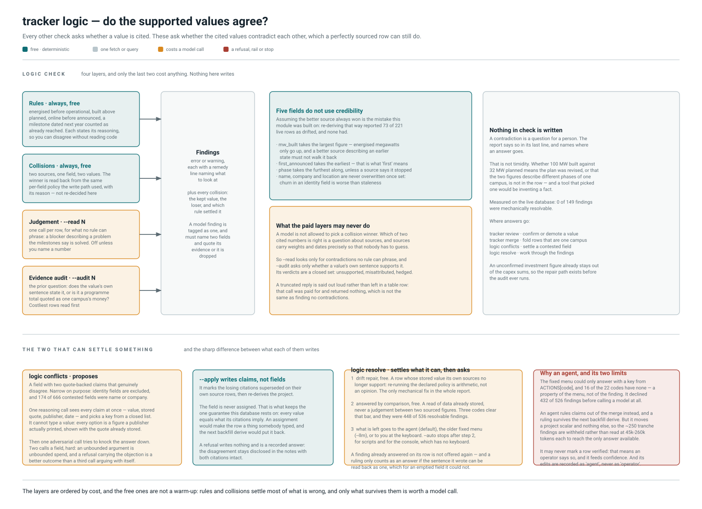

# `tracker logic` and its subcommands

> Find values that contradict each other, and settle the ones that can be.

Every other check in this project asks whether a value is *supported*. These ask
whether the supported values *agree*: a row can be perfectly cited and still be
impossible. A campus marked `operational` whose construction track has reached
nothing is either the wrong phase or a missing milestone, and both citations behind
it can be sound.

`logic check` never writes and runs anywhere. `logic conflicts` writes only with
`--apply`; `logic resolve` writes on every path except a non-interactive run with
no flags. Per `CLAUDE.md` §2, the writing forms run on the production host.

## `logic check` — four layers, and only the last two cost anything

| Layer | Flag | Cost | What it catches |
| --- | --- | --- | --- |
| Rules | always | free | deterministic contradictions computable from the row, its milestones and its obstacles |
| Collisions | `--collisions`, on | free | two sources claiming different values for one field |
| Judgement | `--read N` | one call per row | what no rule can phrase — a blocker describing a problem the milestones say is solved |
| Evidence audit | `--audit N` | one call per row | whether a value's own recorded sentence actually states it |

`--read` and `--audit` both default to 0, and `read_limit=None` means **none**, not
unlimited. That distinction is load-bearing: `None` meant unlimited once, and the
first `--audit`-only run silently started reading every row in the database.

### Rules are free and must stay that way

Paying an LLM to notice that `mw_built > mw_planned` is paying for arithmetic, and
a rule states its reasoning in a way anybody can check without reading code.
`ACTIONS` currently covers 16 codes, and **11 offer no action at all** — each names
something only a person can settle, or a contradiction between a phase enum and a
campus that is two things at once.

### Collisions report the policy's answer; they do not re-decide it

The winner is read back from `upsert.resolve_field` — the same function the write
path used — and printed with its reason. Assuming that reason is always "the better
source won" is the mistake this module was built on: re-deriving winners that way
reported 73 of 221 live rows as having drifted from their sources, and none of them
had. A tool that invents 73 faults is worse than one that finds none.

**Five fields do not use credibility**, by declared policy:

* `mw_built` takes the **largest** figure — energised megawatts only go up, and a
  better source describing an earlier state should not walk it back.
* `first_announced` takes the **earliest**, because that is what "first" means.
* `phase` takes the **furthest along**, unless a source says it stopped.
* `name`, `company` and the location fields are **never overwritten** once set:
  churn in an identity field is worse than staleness.

### What the paid layers may never do

A model is not allowed to pick a collision winner. Which of two cited numbers is
right is a question about sources, and sources carry weights and dates precisely so
that nobody has to guess. Every judgement finding must name two fields and quote
its evidence or it is dropped, and nothing it says is written to the database.

Audit verdicts are a closed set: `unsupported`, `misattributed`, `hedged`. Rows are
read **costliest first** — the audit exists to protect the sums, so the dollars at
stake pick the reading order rather than the row id — and rows with no quoted
values are skipped outright, because a call that could only come back empty is not
worth paying for.

A truncated reply is said out loud rather than left in a table row: that call was
paid for and returned nothing, which is **not** the same as finding no
contradictions.

## `logic conflicts` — proposes

One to two reasoning calls per contested field. This is the one path where a model
compares two contradicting sentences.

**Why it exists.** Every other value in this database was extracted from one
article in isolation, and disagreements between articles are then settled by a sort:
quote-backed first, then source weight, then date. That is the right default and it
cannot tell a superseded figure from a rival one. Hyperion (#10) held Meta's 2024
$10B over its 2026 $50B because both come from the same publisher at the same
weight, and crawl order decided it.

**What counts as a dispute** — four filters, each removing a case a model cannot
help with:

* quote-backed claims only; an unconfirmed claim already loses by rule;
* genuinely different values, by `confidence.values_conflict` — the same tolerance
  the row's own conflict disclosures use;
* tracked fields only; `notes` is assembled and `blocker` is derived from risk rows;
* **never an identity field.** "Hyperion" against "Richland Parish Data Center" is
  two names for one campus, and ruling against a claim would not even move the
  value. Measured: 174 of 666 contested fields were `name` or `company`.

44 claims on one investment figure group down to 5 distinct values, which is what
the model sees — each with its stored quote, publisher and date. **It cannot type a
value:** the options are figures publishers actually printed, so a fabricated
sentence has nowhere to enter by this path.

Then one **adversarial** call tries to knock the answer down. Two calls a field,
hard: the flowchart this came from has a "go round again" arrow with no limit on
it, and an unbounded argument is unbounded spend. An error in the second call lets
the answer stand rather than refusing it — the pick already cleared the confidence
floor on evidence a person can read, and discarding it because a request timed out
would make the outcome depend on the network.

**Refusing is a first-class answer.** Two credible publishers stating two figures
with nothing to separate them is not a coin toss. A refusal writes nothing, and the
disagreement stays disclosed in the row's notes with both citations intact.

### What `--apply` writes is not the field

It marks the losing claims `superseded` on their own source rows and re-derives the
project. The field is never assigned, and that keeps the one guarantee this database
rests on: **every value equals what its citations imply.** An assignment would make
the row a thing somebody typed, and the next `backfill derive` would put it back.

`source.fields` is deliberately left alone — that column means "a verbatim quote
supports this", and a superseded value still has one. The article really did say
$10 billion, and it was right in 2024. It simply stops deciding the merge.

`superseded` and `misread` are separate reasons for the same mechanism, and the
difference matters to a reader: `superseded` says the figure was right when written
and has since been restated, a fact about the world; `misread` says the sentence was
always about something else, a fact about the sentence. The first could stop
applying; the second cannot.

Run `tracker backfill dates` first — the tiebreak and the model both reason from
publication dates. A run of more than 20 fields asks for `--yes`, and writes are
committed per field so a run that dies partway keeps what it settled.

## `logic resolve` — settles what it can, then asks

Three stages before anything is put to a model:

1. **Drift repair, free.** A row whose stored value its own sources no longer
   support. This is the *only* contradiction in the whole report a machine may
   settle, and it is worth being precise about why: it is not a judgement about
   which claim is true — that was decided by the declared per-field policy — but the
   narrower observation that the row no longer matches the answer that policy gives,
   which happens after a hand edit or when a source is attached by a path that did
   not recompute. Re-running the policy is arithmetic.
2. **Answered by comparison, free.** Held to `audit.free_answer`'s bar: a read of
   data already stored, never a judgement between two sourced figures. Two codes
   clear it, and between them they were **448 of 536** resolvable findings — which
   is most of what makes a whole-database pass affordable.
3. **What is left** goes to the agent (default), the older fixed menu (`--llm`), or
   to a person at the keyboard. `--auto` stops after stage 2, for scripts and for
   the console, which has no keyboard.

Findings already answered on their row are dropped unless `--again`. `audit resolve`
had skipped settled findings since it was written; `logic resolve` did not, so it
re-offered all 1,272 every run — including 384 of one code — and a person or a model
had to decline the same question every time. That is also what makes "open findings"
a number that can fall.

Findings something can be *done* about sort first. The list was ordered by project
id, so `--limit 30` handed over thirty questions whose only answers were "verify"
and "skip", while the ones with a real edit behind them sat at position 190.

### Why an agent, not the menu

The menu could only answer with a key from `ACTIONS[code]`, and 11 of 16 codes have
none — a property of the menu, not of the finding. It returned "nothing to choose
between" **before calling the model** for 432 of 526 findings, 334 of them about
tranches. The model was never the cautious party.

An agent rules **claims** out of the merge instead, which is available on every
code. That is also why its rulings last: a project scalar is a cache of the claim
set, so every field-assigning action in `logic.py` is transient — clear `mw_built`
on #14, commit, derive, and 230.0 comes back. `no_inversions` sat at exactly 30
failures across a run that "resolved" `built_exceeds_planned` 18 times.

`RULEABLE_FIELDS` excludes the identity fields for the same reason `conflicts` does:
superseding a claim about them changes nothing and would only look like it had.

### Two things a model may never do

* It cannot mark a row **verified**. That means "an operator says this is right",
  and it feeds the confidence score.
* Its edits are recorded as `agent` or `model resolved`, never `operator resolved`,
  so a reader six months later can tell that nobody looked.

Each finding is committed individually, so a provider failure on row 40 keeps the
first 39, and a database error while *applying* a ruling rolls back that finding
rather than ending the batch — an `IntegrityError` on `phase` once killed the logic
phase of three overnight rounds out of five after a single bad finding.

## Why there is no button that fixes everything

Whether 100 MW built against 32 MW planned means the plan was revised or that the
two figures describe different phases of one campus is not in the row, and a tool
that picked one would be inventing a fact. Measured on the live database: **0 of 149
findings were mechanically resolvable.** An unconfirmed investment figure already
stays out of the capex sums, so the repair path exists before the audit runs.

## Source map

Touching any of these means the poster is in scope. Re-render with
`python scripts/render_workflow_diagrams.py logic`.

| Concern | Where |
| --- | --- |
| The four layers, and the spend dials | `tracker/logic.py` — `review`, `MAX_TOKENS` |
| Rules | `tracker/logic.py` — `check_rules`, `_check_stored_against_evidence`, `dedupe`, `ERROR`, `WARNING` |
| Collisions and the per-field policy | `tracker/logic.py` — `check_collisions`, `why_decided`, `decision`; `tracker/upsert.py` — `FIELD_POLICY`, `Policy`, `resolve_field` |
| Judgement and the evidence audit | `tracker/logic.py` — `examine`, `audit_evidence`, `parse_contradictions`, `parse_evidence_findings`, `AUDIT_VERDICTS`, `auditable_fields` |
| Actions, and which codes have none | `tracker/logic.py` — `ACTIONS`, `resolvable`, `free_answer`, `record_decision` |
| Drift repair | `tracker/logic.py` — `resolve_drift`; `tracker/upsert.py` — `recompute_from_sources` |
| Contested fields, the two calls, the write | `tracker/conflicts.py` — `disputes`, `solve`, `_challenge`, `supersede`, `apply_outcome`, `MAX_CALLS_PER_FIELD`, `MIN_CONFIDENCE`, `SUPERSEDED`, `MISREAD` |
| The agent path | `tracker/triage.py` — `triage`, `apply_rule_out`, `rule_out_tool`, `leave_alone_tool`, `RULEABLE_FIELDS`, `SYSTEM` |
| The fixed menu and the keyboard walk | `tracker/logic.py` — `decide`, `TRIAGE_MIN_CONFIDENCE`; `tracker/cli/logic.py` — `_triage_by_agent`, `_triage_by_model`, `_triage` |
| Settled-finding bookkeeping | `tracker/audit.py` — `settled_codes`, `free_answer` |
| CLI | `tracker/cli/logic.py` — `logic_check`, `logic_conflicts`, `logic_resolve` |

See also: [enrich](enrich.md), whose settle stage is `logic conflicts` with
`--apply` already implied and run automatically after every harvest.
