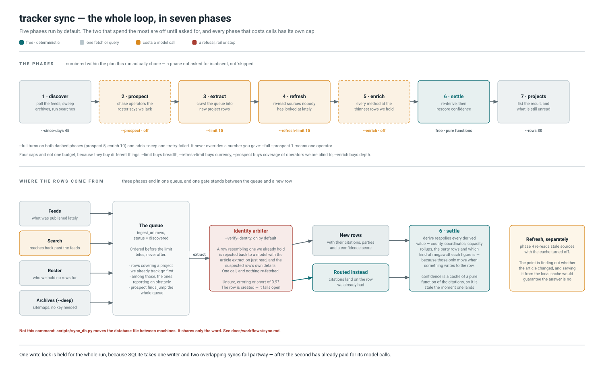

# `tracker sync`

> Everything in one command: find what is missing, read it, settle it, list it.

Seven phases. Five run on a bare `tracker sync`, which is the cheap keep-current
run it has always been; the two that spend the most are off until asked for.

It **writes**, holds one write lock for the whole run, and per `CLAUDE.md` §2 runs
on the production host:

```bash
ssh $PROD 'tracker sync --full'
```

> **Not `scripts/sync_db.py`.** That moves the database *file* between machines and
> shares only the word. It is [below](#the-other-sync).



## The phases

Numbered within the plan *this* run chose. A phase that was not asked for is
absent from the count rather than shown as skipped — "2/7 prospect — skipped" on
every ordinary run would train a reader to ignore the labels, and the point of
numbering a long run is that somebody watching it knows how much is left.

| | Phase | Default | Cap |
| --- | --- | --- | --- |
| 1 | **discover** — poll feeds, sweep archives (`--deep`), run searches | on | `--since-days 45`, `--search` |
| 2 | **prospect** — chase operators the roster says we hold no rows for | **off** | `--prospect N` |
| 3 | **extract** — crawl the queue into new project rows | on | `--limit 15` |
| 4 | **refresh** — re-read sources nobody has looked at lately | on | `--refresh-days 30`, `--refresh-limit 15` |
| 5 | **enrich** — every method at the thinnest rows we hold | **off** | `--enrich N`, `--enrich-budget 60` |
| 6 | **settle** — re-derive, then rescore confidence | on | free |
| 7 | **projects** — list the result, and what is still unread | on | `--rows 30` |

`--full` turns on both optional phases (`prospect 5`, `enrich 10`) and adds
`--deep` and `--retry-failed`. It does **not** override a number you gave:
`--full --prospect 1` means one operator, because a flag that silently discarded
the value beside it would be a trap.

### Four caps, not one budget

They buy different things, and a single budget spread across all four would
silently favour whichever phase ran first.

* `--limit` buys **breadth** — new rows.
* `--refresh-limit` buys **currency** — rows that are still true.
* `--prospect` buys **coverage** of operators we are blind to. Nebius was absent
  from 300 projects and no amount of feed polling was ever going to say so.
* `--enrich` buys **depth** on rows that already exist.

## Where the queued rows come from

Three phases end in the same queue and answer different questions. Discover and
search ask *what is being published*; prospect asks *who are we blind to*, which is
a question only the roster can pose. Prospect runs **before** extract so its finds
are eligible for this run's crawl rather than the next one.

The queue is ordered **before** `--limit` bites, never after — truncating first and
prioritising after would reorder a batch that was already chosen:

1. Candidates covering a project we already track go first (`known_first`). A
   queued article about a tracked project becomes a *second* source, which fills
   fields one article cannot and lifts confidence from 2 to 3. Draining oldest-first
   instead just grows the database sideways with more single-source rows.
   `--breadth-first` opts out.
2. Among those, the ones reporting an obstacle. A press release never names its own
   blocker, so those are the only calls that can record one at all.
3. Prospect's finds jump the whole queue. `known_first` sorts by "covers a project
   we already track", which an article about an operator we have **no** rows for can
   never satisfy — so left to the ordinary ordering it sits behind a permanent
   supply of better candidates and is never read.

Publishers that `tracker/seed/sources.toml` ignores are partitioned out and **named**, not
merely subtracted: the queue still holds those rows and `tracker queue` still lists
them, so the number has to be attributable.

## The identity arbiter

`--verify-identity` is on by default. Before a phase creates a row that has a
near-match, one model reads the arriving article and says whether it is the same
site — preventing the duplicate rather than reporting it afterwards.

**It judges from the article extraction already read.** The proposed row is rejected
back to a model with everything needed in one turn: the article as the extractor saw
it, the row we think it duplicates (name, company, locality, phase, capacity and its
citations), and which of `_find_duplicate_candidate`'s three branches matched. It
answers `same_site`, `different_site` or `unsure`, and nothing else.

That is one call. The older path needed three or four, because its instructions began
by telling the model to `read_article` the arriving URL — re-fetching, over a corpus
where that answers 403 often enough to matter, the article that had just been read.
Extraction and adjudication stay different steps on different model tiers, which is
right; what crosses between them is the evidence, not a conversation. The cold path
remains for callers with no extraction context and for providers with no multi-turn
call.

**It is asked the same question as the two pair judges.** `triage.CONTRADICTIONS` is
one checklist shared verbatim by all three, so the judgement made at ingest and the
judgement made a week later on the stored rows cannot drift apart; a test pins the
copies together. It asks what would rule the match out, not whether the rows look
alike, and it reports what it checked alongside its verdict — that list is written
into the row's notes with the routing decision. See
[duplicates](duplicates.md#which-judge).

**It fails open, always.** Unsure, erroring, or short of the 0.9 floor and the row
is created exactly as it would have been. The worst case is the status quo, which
is what makes it safe to leave on. The floor is deliberately higher than the 0.85 a
*merge* of two stored rows needs: a merge is reviewed against two full rows of
citations, while this is decided from one arriving article.

**A `same_site` must quote the article**, and the quote is checked against the text
the model was *shown* rather than the full stored article. Extraction truncates —
head, marker, tail — so verifying against the whole thing would pass a sentence from
the omitted middle and leave a gate that proves nothing.

It is passed to both the extract and refresh phases through one helper
(`_identity_arbiter`), so the two cannot drift into different rules about when a
row may be created. Refresh re-reads URLs already attached, so it matches by key
and the arbiter almost never fires there — but `force=True` means that path *can*
still create a row, and a duplicate born in refresh would be no cheaper than one
born in extract.

See [duplicates](duplicates.md) for what the same judgement costs once the row
exists: 47 stored groups took a ten-hour agent run.

## Two deliberate cache decisions

* **Discover writes into the cache the extract phase reads.** Feeds that syndicate
  the whole article put it there, so phase 3 never requests a page that would
  answer 403.
* **Refresh passes `cache_dir=None`.** The point of refreshing is finding out
  whether the article changed, and serving it from the local cache would guarantee
  the answer is no.

## The settle phase

Two recomputations, both pure functions of what the rows now cite, and both wrong
to skip after a phase that added sources:

* `derive` reapplies every derived value — county, coordinates, capacity rollups —
  because those are only recomputed when something writes to the row.
* `recompute_confidence` runs because confidence is a cache of a function of the
  citations, so it is stale the moment a citation lands. It runs even when
  `--skip-derive` declined the first half.

## What the summary always says

Unread URLs are invisible to both `discover` (which never re-queues a known URL)
and the pending queue, so without an explicit line a run would report "queue empty,
0 failed" while articles pile up. The count is reported whether or not *this* run
retried them. Coverage of operators we should hold is likewise a separate question
a clean sync cannot see, so a run without `--prospect` points at `tracker coverage`.

## The other sync

`scripts/sync_db.py` is a different tool with a colliding name: it moves the
whole database file between this machine and the production host. Reads run
anywhere; **the host is the writer**, so the default direction is *pull*.

```bash
python scripts/sync_db.py            # pull the authoritative database down here
python scripts/sync_db.py --push     # only to seed or restore a host
```

Both directions **refuse when the destination holds rows the source does not**,
which is what losing an ingest looks like from the other end. `--force` overrides
it deliberately; `--dry-run` checks and changes nothing.

Neither direction copies the file. SQLite runs in WAL mode, so committed data sits
in `tracker.db-wal` until a checkpoint folds it back: copying `tracker.db` alone
yields a file that opens cleanly and is silently out of date — 16.3 MB of main file
against a 7.9 MB WAL, measured. `VACUUM INTO` asks SQLite for a consistent
single-file snapshot instead, run on whichever machine is the source, then
`pragma integrity_check` and a row-count comparison verify it *before* it replaces
anything. A pull also unlinks the old `-wal` and `-shm` siblings, which describe a
database that no longer exists here.

Row counts are compared over ssh rather than by fetching 16 MB. The table names are
singular, and getting that wrong is silent — an earlier version counted
`projects`/`sources`, nothing matched, and the snapshot was reported "verified"
having checked nothing. Both directions now refuse outright when no table is
recognised.

## Source map

Touching any of these means the poster is in scope. Re-render with
`python scripts/render_workflow_diagrams.py sync`.

| Concern | Where |
| --- | --- |
| Phase order, plan numbering, `--full`, the lock | `tracker/cli/sync.py` — `sync`, its `plan` list and `step` |
| Discover, archives, search | `tracker/ingest/discover.py` — `run`, `load_sitemaps`, `sweep_sitemaps`, `queue_candidates`; `tracker/ingest/search.py` |
| Queue ordering and counts | `tracker/ingest/discover.py` — `pending`, `pending_split`, `pending_risk_count`, `failed`, `failure_summary` |
| Prospect | `tracker/prospect.py`; `tracker/roster.py` — `hunt_order`, `measure` |
| Extract and refresh | `tracker/ingest/crawl.py` — `run`, `stale_sources` |
| Identity arbiter | `tracker/cli/ingest.py` — `_identity_arbiter`, `_report_arbiter`; `tracker/gatekeeper.py` — `same_site_arbiter`, `_warm_verdict`, `_cold_verdict`, `_rejection`, `_suspicion`, `_verdict_tools`, `RULES`, `MIN_CONFIDENCE`; `tracker/triage.py` — `CONTRADICTIONS`; `tracker/ingest/crawl.py` — `ExtractionContext` |
| Enrich phase | `tracker/ingest/enrich.py` — `select_projects`, `run_many`; and [enrich](enrich.md) |
| Settle | `tracker/derive.py` — `run`; `tracker/upsert.py` — `recompute_confidence` |
| Source ignore list | `tracker/policy.py` — `load`, `partition` |
| The database mover | `scripts/sync_db.py` — `pull`, `push`, `snapshot`, `verify`, `_COUNTED` |
