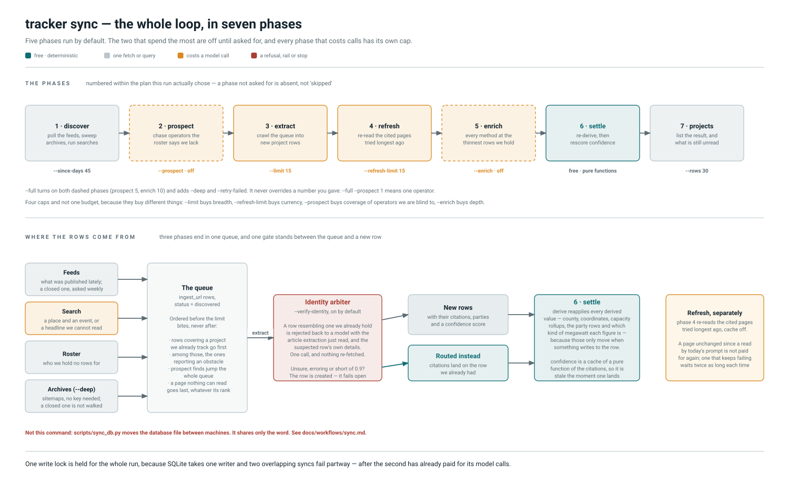

# `tracker sync`

> Everything in one command: find what is missing, read it, settle it, list it.

Seven phases. Five run on a bare `tracker sync`, which is the cheap keep-current
run it has always been; the two that spend the most are off until asked for.

It **writes**, holds one write lock for the whole run, and per `CLAUDE.md` §2 runs
on the production host:

```bash
ssh $PROD 'tracker sync --full'
```

> **Not `scripts/sync_db.py`.** That moves the database *file* between machines and
> shares only the word. It is [below](#the-other-sync).



## The phases

Numbered within the plan *this* run chose. A phase that was not asked for is
absent from the count rather than shown as skipped — "2/7 prospect — skipped" on
every ordinary run would train a reader to ignore the labels, and the point of
numbering a long run is that somebody watching it knows how much is left.

| | Phase | Default | Cap |
| --- | --- | --- | --- |
| 1 | **discover** — poll feeds, sweep archives (`--deep`), run place-anchored searches | on | `--since-days 45`, `--search` |
| 2 | **prospect** — chase operators the roster says we hold no rows for | **off** | `--prospect N` |
| 3 | **extract** — crawl the queue into new project rows | on | `--limit 15` |
| 4 | **refresh** — re-read the cited articles tried longest ago | on | `--refresh-days 30`, `--refresh-limit 15` |
| 5 | **enrich** — every method at the thinnest rows we hold | **off** | `--enrich N`, `--enrich-budget 60` |
| 6 | **settle** — re-derive, then rescore confidence | on | free |
| 7 | **projects** — list the result, and what is still unread | on | `--rows 30` |

`--full` turns on both optional phases (`prospect 5`, `enrich 10`) and adds
`--deep` and `--retry-failed`. It does **not** override a number you gave:
`--full --prospect 1` means one operator, because a flag that silently discarded
the value beside it would be a trap.

### Four caps, not one budget

They buy different things, and a single budget spread across all four would
silently favour whichever phase ran first.

* `--limit` buys **breadth** — new rows.
* `--refresh-limit` buys **currency** — rows that are still true.
* `--prospect` buys **coverage** of operators we are blind to. Nebius was absent
  from 300 projects and no amount of feed polling was ever going to say so.
* `--enrich` buys **depth** on rows that already exist. Its agent pass — the
  ~77,000-token rung after the harvest — sees only the rows the harvest actually
  reached, as in `tracker enrich`; it was handed every chosen row, so even
  `--enrich-budget 0`, which reaches none, paid for a model call on each. It shares
  enrich's savings: a page unchanged since its last read under the same prompt is
  not sent again (the rule the refresh phase below applies), an article is read for
  the row being enriched only, and a row with no fillable field left empty is not
  chosen. See [enrich](enrich.md#what-a-read-costs-and-what-is-not-read-again).

## What search looks for, and why it is not a model's idea

Search used to ask a model to **name projects** to look for. That can only ever
reach projects somebody already wrote enough about for a model to have learned
them, which are the ones already stored — so the one phase meant to reach past the
configured feeds was pointed at the same ground they cover.

It now names a **place and an event** instead, and needs neither the operator nor
the campus: *"Loudoun County Virginia data center rezoning application"*. A county
votes on a rezoning before anybody announces anything and publishes the agenda
either way, which is how this can surface a site nobody here has heard of.

Both halves are derived rather than written down. The events are a fixed table of
ten, each carrying a term the discovery filter already recognises — a phrase the
filter would reject returns hits that are all discarded before they cost a fetch,
and leaves no queued row to say so. The places come from the database: counties
already holding two or more projects first, because campuses cluster; then states
carrying capacity on thin coverage; then, capped at two slots, states holding
nothing at all.

**A place the filter cannot accept is reported, not skipped.** `exclude` is a
substring test, so `summit` (there for conference write-ups) and `stock` (there for
finance coverage) make Summit County and Stockton unsearchable for any query. Left
in the plan such a place spends a slot every run and returns nothing.

**Each run walks the diagonal of the cross product**, preferring pairs that have
never produced anything. Taking the first N in rank order instead would spend a
whole run on one county and re-run the identical queries the following night.

`tracker search --plan 10 --print-only` shows the plan and its labels, costs
nothing and needs no key.

**`--search N` now means N queries.** It used to mean "ask a model for N queries",
while the number actually issued was capped separately inside the run — so
`--search 25` announced 25 and sent 10. The count is capped against
`TRACKER_SEARCH_MAX_QUERIES` before anything is printed, and the printed number is
the number run.

`--from-llm` still exists and still asks a model for project names. It is kept
deliberately: it is the one path that can name an operator in a place holding no
rows, and running both is what lets `tracker queue stats` say which is worth the
quota rather than leaving it asserted.

## A feed that refuses every client is closed, not deleted

On 2026-10-02 thirteen of the 28 feeds — datacenterdynamics, datacenterfrontier and
all eleven States Newsroom sites — and the datacenterfrontier archive answered every
request with a Cloudflare challenge: a page that lets through only a client that runs
the site's own detection script. A browser's User-Agent changes nothing, nor does a
browser's TLS fingerprint, and the article pages answer the same way. Getting past it
would mean passing the publisher's bot detection, which this project does not do, so
a request to any of them can only fail.

Those entries now carry `closed = "<date>: <what was measured>"` in
`tracker/seed/feeds.toml`, beside the measurements:

* **A closed feed is not polled, and a closed archive is not walked** — by
  discover, by `--deep`, or by enrich's archive harvest. The report counts them as
  `feeds closed`, apart from `feeds failed`: thirteen failures a night that everyone
  expects would teach a reader to stop reading that line, and the fourteenth, which
  nobody expected, would go unseen.
* **They stay in the file.** `tracker feeds` proposes publishers whose citations
  decide stored values and that the file does not list. datacenterfrontier decides
  more than any other, so deleting it would put it at the head of that list for
  good; a closed entry still counts as listed.
* **A challenge is named when one is met.** Cloudflare marks the page
  `cf-mitigated: challenge`, and the failure line says `HTTP 403 (Cloudflare
  challenge: …)` rather than a bare 403, which reads as a header problem and is not.
* **What they queued before the block is still queued** — 650 rows on 2026-10-02,
  522 of them datacenterfrontier's — and those pages answer the same challenge. Only
  the 22 whose syndicated body was cached when they were queued can be read, so
  every crawl puts the rest after every page it can read; see rule 4 below.

**Each is asked again once a week** (migration 0034, `discover.probe_closed`):
one request to the entry's own URL, with discovery's usual client, from
`tracker discover` — so the nightly loop does it without being told. An entry whose
check comes back as a real feed or sitemap is polled again from that night, and its
pages stop being read last; the first poll that fails closes it again the same
night. The checks are rows in `feed_probe`, not edits to the file, because the
host's checkout is reset to the pushed commit every two minutes. When a reopening
has held, delete the `closed` line. `tracker discover --probe-closed --dry-run`
asks every one now. On 2026-10-07 all fourteen still answered with the challenge,
from two networks and from a browser.

## Headlines from a publisher we cannot read

A `[[feed]]` with `headlines_of = "<site>"` lists another publisher's articles —
Google News's RSS search for datacenterdynamics.com and datacenterfrontier.com, the
two most-cited sources before they closed. Its links lead back to the blocked page,
so nothing from it is queued. A headline has to name the topic itself or state a
capacity ("1GW") — DCD also covers telecom, chips and quantum, and on the first
night 23 of its 39 headlines were those — and the publishers' surveys and polls are
dropped. Then `discover.follow_headlines` looks each remaining headline up once (Serper, about $0.001, at most 40 a run), with every closed
publisher excluded, and queues up to two results that tell the same story — most
of the headline's distinctive words — dated like the headline so the news-first
crawl reads them first. A result whose title repeats the headline word for word is
a reposting site carrying the blocked article, and is skipped: reading it there
would be reading it anyway. The headline itself is stored as a `skipped` row, so
it is looked up once and never handed to the crawl. Measured on 12 DCD headlines
on 2026-10-07: 10 readable copies for 7 stories — PennLive and WJAC on AWS's
Indiana County campus, San José Spotlight on the IBM site, Applied Digital's own
release, and two reposts left out.

Bisnow is the other kind of failure. Its data-center feed went away when the site
was rebuilt — `/rss/data-center` now redirects to a 404 — so that entry was
replaced rather than closed, by `bisnow-latest`: the one feed it still serves, the
nine newest stories across every market.

## Where the queued rows come from

Three phases end in the same queue and answer different questions. Discover and
search ask *what is being published*; prospect asks *who are we blind to*, which is
a question only the roster can pose. Prospect runs **before** extract so its finds
are eligible for this run's crawl rather than the next one.

The queue is ordered **before** `--limit` bites, never after — truncating first and
prioritising after would reorder a batch that was already chosen:

1. Candidates covering a project we already track go first (`known_first`). A
   queued article about a tracked project becomes a *second* source, which fills
   fields one article cannot and lifts confidence from 2 to 3. Draining oldest-first
   instead just grows the database sideways with more single-source rows.
   `--breadth-first` opts out.
2. Among those, the ones reporting an obstacle. A press release never names its own
   blocker, so those are the only calls that can record one at all.
3. Prospect's finds jump the whole queue. `known_first` sorts by "covers a project
   we already track", which an article about an operator we have **no** rows for can
   never satisfy — so left to the ordinary ordering it sits behind a permanent
   supply of better candidates and is never read.
4. **A page nothing can read goes last, whatever its rank.** A publisher marked
   `closed` answers every client with a challenge, its articles included, so a page
   on one can only fail unless its body was cached before the block. After every
   rule above — and after the `priority` ranks in `tracker/seed/sources.toml` — such
   a page is moved behind every readable one, and only then is the limit cut.
   Nothing is dropped: it stays queued and is tried when nothing readable is left,
   which is also how a block that has lifted gets noticed. On 2026-10-02, 628 of the
   2,287 queued articles were such pages. They held six of the nightly crawl's next
   ten slots and all fifteen of a sync extract, because datacenterfrontier and
   datacenterdynamics both rank `priority`.

`ingest crawl --from-queue --new-first` asks a different question, and is what the
nightly loop's discovery step runs. **The news goes first:** every article published
within the email's window (`feed.REPORT_WINDOW_DAYS`, 60 days), newest first,
whatever campus it names, because what the crawl reads tonight is mailed tomorrow. A
2026-09-21 report of a lawsuit against a *tracked* campus used to sort behind 1,600
backlog articles; it was read on 10-03 and mailed on 10-04 as news. Then the articles
naming **no** tracked campus, newest published first, then the rest — rule 4 applying
throughout. Enrich reads for
one row and creates none, so that step is the loop's only source of new campuses;
each article still goes through the identity arbiter below before it can insert a
row. The same rule orders `--retry-failed`'s fill, the refresh phase below, and
each round of [enrich](enrich.md#what-a-read-costs-and-what-is-not-read-again).

Publishers that `tracker/seed/sources.toml` ignores are partitioned out and **named**, not
merely subtracted: the queue still holds those rows and `tracker queue` still lists
them, so the number has to be attributable.

**A page is queued once, whatever its spelling.** Tracking parameters — Google's
`srsltid` rides on every search hit — are dropped before a URL is stored, and a
candidate is already known when another spelling of it (`www.`, a trailing slash,
`http`) is. The same identity keys a project's citations, so one article cannot be
cited twice: 19 projects on a copy of production did, and 69 queued URLs had a
second spelling already in the table.

Prevention does not reach rows already stored, so `tracker backfill urls` repairs
them — a preview, and `--apply` to write. A row's extra copies of one article are
folded into its earliest by the rule `tracker merge` applies to a shared citation
(what only a copy said is carried, a rival figure is named, milestones and
obstacles move with it), and an article a citation shows was read leaves the retry
pool its failed re-read had put it in. On the snapshot: 23 extra citations on 17
rows, one of them the same report five times, and 36 read articles, with no
figure moving. A second pass finds nothing.

**A page not in English is refused before extraction.** Search already dropped
non-English hits by their title and snippet; a feed or an archive had no such
test, and a translated repost is read for its identity, which is the part that
comes back wrong. Of 70 stored citations from Chinese-language pages, 68 carried a
"confirmed" city — "孟菲斯" for Memphis, "Salien" for Saline — and seven rows
rested on nothing else, each a garbled duplicate of a campus held under its
English name. `crawl.extract_one` marks such a page `skipped` before the call, the
run summary counts it as "not in English", and it is not retried.

## The identity arbiter

`--verify-identity` is on by default. Before a phase creates a row that has a
near-match, one model reads the arriving article and says whether it is the same
site — preventing the duplicate rather than reporting it afterwards.

**It judges from the article extraction already read.** The proposed row is rejected
back to a model with everything needed in one turn: the article as the extractor saw
it, the row we think it duplicates (name, company, locality, phase, capacity and its
citations), and which of `_find_duplicate_candidate`'s three branches matched. It
answers `same_site`, `different_site` or `unsure`, and nothing else.

That is one call. The older path needed three or four, because its instructions began
by telling the model to `read_article` the arriving URL — re-fetching, over a corpus
where that answers 403 often enough to matter, the article that had just been read.
Extraction and adjudication stay different steps on different model tiers, which is
right; what crosses between them is the evidence, not a conversation. The cold path
remains for callers with no extraction context and for providers with no multi-turn
call.

**It is asked the same question as the two pair judges.** `triage.CONTRADICTIONS` is
one checklist shared verbatim by all three, so the judgement made at ingest and the
judgement made a week later on the stored rows cannot drift apart; a test pins the
copies together. It asks what would rule the match out, not whether the rows look
alike, and it reports what it checked alongside its verdict — that list is written
into the row's notes with the routing decision. See
[duplicates](duplicates.md#which-judge).

**It fails open, always.** Unsure, erroring, or short of the 0.9 floor and the row
is created exactly as it would have been. The worst case is the status quo, which
is what makes it safe to leave on. The floor is deliberately higher than the 0.85 a
*merge* of two stored rows needs: a merge is reviewed against two full rows of
citations, while this is decided from one arriving article.

**A `same_site` must quote the article**, and the quote is checked against the text
the model was *shown* rather than the full stored article. Extraction truncates —
head, marker, tail — so verifying against the whole thing would pass a sentence from
the omitted middle and leave a gate that proves nothing.

**It never runs inside an open write.** SQLite takes one writer and the console's
sign-in waits five seconds for it, so each record's writes are committed before the
next record is upserted — the arbiter used to be asked about an article's second
project with the first project's writes still holding the lock, for the length of a
model call. **A `--dry-run` does not ask it at all**: a verdict nothing is written
for is a cost with nothing to show, so the dry run counts the insert the arbiter
might have prevented. A dry run also rolls each article back as it goes rather than
holding one transaction from the first URL to the last.

It is passed to both the extract and refresh phases through one helper
(`_identity_arbiter`), so the two cannot drift into different rules about when a
row may be created. Refresh re-reads URLs already attached, so it matches by key
and the arbiter almost never fires there — but `force=True` means that path *can*
still create a row, and a duplicate born in refresh would be no cheaper than one
born in extract.

See [duplicates](duplicates.md) for what the same judgement costs once the row
exists: 47 stored groups took a ten-hour agent run.

## What the refresh phase re-reads

The cited articles **tried longest ago**, by `ingest_url.last_tried_at` — falling
back to the citation's own `fetched_at` for a URL no crawl has recorded. It used to
be the URL with the oldest *citation row*, which only a successful write of every
row citing it ever moves: a re-read that failed, or that refreshed two of the six
rows citing a page, left that URL at the head for good. Measured on a copy of
production, the fifteen URLs the phase took every run were 11 `llm_error`, 3
`fetch_error` and 1 `ok`, tried 4 to 24 times each, and the other 1,945 stale URLs
were never reached. Any try now moves the URL to the back.

* **A URL that keeps failing waits longer each time.** Each failed re-read in a row
  doubles its interval (`ingest_url.failures`), up to sixteen intervals, so a page
  behind a WAF the ladder cannot clear stops costing a try every run without being
  given up on.
* **A page on a closed publisher goes last.** The backoff would retire one after a
  few failed runs, but each of those runs spends a slot on it, and the publishers
  closed on 2026-10-02 include the most-cited one in the database. The refresh reads
  past the cache on purpose (below), so here every such page counts as unreadable.
* **A failed re-read does not unread the URL.** It keeps the `ok` its good read
  earned — the citations still stand — and records the failure beside it. Demoting
  it had put 35 cited URLs into the pool `--retry-failed` works.
* **An unchanged page is not paid for twice.** When a page hashes the same as its
  last good read, and every citation that read produced carries today's prompt
  stamp, the model is not asked again (`crawl.run(skip_unchanged=True)`); the URL is
  recorded as tried and counted as `page unchanged, not re-read`.
* **Only what an article reading produced.** `derived:` and `inferred:` citations
  were computed, not read — the Census reference file behind 365 derived citations
  sat at the head of the old order and was fetched and sent through extraction on
  every run — and an ISO queue row's URL is the queue's listing page.

## Two deliberate cache decisions

* **Discover writes into the cache the extract phase reads.** Feeds that syndicate
  the whole article put it there, so phase 3 never requests a page that would
  answer 403.
* **Refresh passes `cache_dir=None`.** The point of refreshing is finding out
  whether the article changed, and serving it from the local cache would guarantee
  the answer is no.

## The settle phase

Two recomputations, both pure functions of what the rows now cite, and both wrong
to skip after a phase that added sources:

* `derive` reapplies every derived value — county, coordinates, capacity rollups —
  because those are only recomputed when something writes to the row.
* `recompute_confidence` runs because confidence is a cache of a function of the
  citations, so it is stale the moment a citation lands. It runs even when
  `--skip-derive` declined the first half.

## What the summary always says

Unread URLs are invisible to both `discover` (which never re-queues a known URL)
and the pending queue, so without an explicit line a run would report "queue empty,
0 failed" while articles pile up. The count is reported whether or not *this* run
retried them.

**`--retry-failed` stops at three identical failures.** A URL that has failed the
same way three tries running (`discover.MAX_SAME_FAILURES`) is left out of the
retry and named in the summary instead: a transient failure rarely repeats
identically on three separate runs, and a structural one repeats every time.
Measured on a copy of production, 9 URLs failing "reply truncated" had been tried 66
times and 14 failing with one SSL error 190 times. The same test governs enrich's
retry harvester and the queued leads `--prospect` hands the crawl. `tracker ingest
crawl --url` still reads one, and the retry after a starved reply no longer doubles
past the configured token ceiling. Coverage of operators we should hold is likewise a separate question
a clean sync cannot see, so a run without `--prospect` points at `tracker coverage`.

## The other sync

`scripts/sync_db.py` is a different tool with a colliding name: it moves the
whole database file between this machine and the production host. Reads run
anywhere; **the host is the writer**, so the default direction is *pull*.

```bash
python scripts/sync_db.py            # pull the authoritative database down here
python scripts/sync_db.py --push     # only to seed or restore a host
```

Both directions **refuse when the destination holds rows the source does not**,
which is what losing an ingest looks like from the other end. `--force` overrides
it deliberately; `--dry-run` checks and changes nothing.

Neither direction copies the file. SQLite runs in WAL mode, so committed data sits
in `tracker.db-wal` until a checkpoint folds it back: copying `tracker.db` alone
yields a file that opens cleanly and is silently out of date — 16.3 MB of main file
against a 7.9 MB WAL, measured. `VACUUM INTO` asks SQLite for a consistent
single-file snapshot instead, run on whichever machine is the source, then
`pragma integrity_check` and a row-count comparison verify it *before* it replaces
anything. A pull also unlinks the old `-wal` and `-shm` siblings, which describe a
database that no longer exists here.

Row counts are compared over ssh rather than by fetching 16 MB. The table names are
singular, and getting that wrong is silent — an earlier version counted
`projects`/`sources`, nothing matched, and the snapshot was reported "verified"
having checked nothing. Both directions now refuse outright when no table is
recognised.

## Source map

Touching any of these means the poster is in scope. Re-render with
`python scripts/render_workflow_diagrams.py sync`.

| Concern | Where |
| --- | --- |
| Phase order, plan numbering, `--full`, the lock | `tracker/cli/sync.py` — `sync`, its `plan` list and `step` |
| Discover, archives, search | `tracker/ingest/discover.py` — `run`, `load_config`, `load_sitemaps`, `sweep_sitemaps`, `queue_candidates`; `tracker/ingest/search.py`; `tracker/normalize.py` — `canonical_url`, `url_identity`, `url_variants`; `tracker/backfill.py` — `repair_urls` |
| Closed feeds, and naming a challenge | `tracker/seed/feeds.toml` — `closed`; `tracker/ingest/discover.py` — `FeedSpec.closed`, `SitemapSpec.closed`, `_closed_reason`, `DiscoverReport.closed`, `_RawFetcher`, `CHALLENGE_NOTE`; `tracker/ingest/probe.py` — `configured_hosts` |
| The weekly check of closed entries | `tracker/ingest/discover.py` — `probe_closed`, `record_probe`, `reopened_names`, `without_reopened`, `PROBE_EVERY`; migration `0034_feed_probe`; `tracker/cli/sync.py` — `discover --probe-closed` |
| Headlines-only feeds | `tracker/seed/feeds.toml` — `headlines_of`; `tracker/ingest/discover.py` — `parse_headlines`, `follow_headlines`, `same_story`, `copies_headline`, `MAX_HEADLINE_LOOKUPS` |
| Pages nothing can read go last | `tracker/ingest/discover.py` — `closed_domains`, `unreadable_test`, `readable_first`, `pending(unreadable=)`, `retryable(unreadable=)`; `tracker/ingest/crawl.py` — `stale_sources(unreadable=)`; `tracker/cli/sync.py` — `sync` (extract, retry fill, refresh); `tracker/cli/ingest.py` — `crawl --from-queue`; `tracker/ingest/enrich.py` — `run` |
| What search looks for | `tracker/ingest/search.py` — `_PLACE_TEMPLATES`, `rank_places`, `plan_queries`, `PlannedQuery.label`, `templates`; `tracker/normalize.py` — `state_name` |
| Judging a template | `tracker/funnel.py` — `feed_group`, `survey`, `verdicts`; `tracker/ingest/search.py` — `LabelStat` |
| Queue ordering and counts | `tracker/ingest/discover.py` — `pending` (`known_first`, `new_first`; news first by `feed.REPORT_WINDOW_DAYS`), `pending_split`, `pending_risk_count`, `failed`, `retryable`, `given_up`, `MAX_SAME_FAILURES`, `failure_summary` |
| Prospect | `tracker/prospect.py`; `tracker/roster.py` — `hunt_order`, `measure` |
| Extract and refresh | `tracker/ingest/crawl.py` — `run`, `stale_sources`, `unchanged_reads`, `record_url`, `failure_reason`, `MAX_REFRESH_BACKOFF` |
| The party gate | `tracker/ingest/crawl.py` — `_parties`, `_ROLE_MARKERS`, `_role_is_licensed` |
| Identity arbiter | `tracker/cli/ingest.py` — `_identity_arbiter`, `_report_arbiter`; `tracker/gatekeeper.py` — `same_site_arbiter`, `_warm_verdict`, `_cold_verdict`, `_rejection`, `_suspicion`, `_verdict_tools`, `RULES`, `MIN_CONFIDENCE`; `tracker/triage.py` — `CONTRADICTIONS`; `tracker/ingest/crawl.py` — `ExtractionContext` |
| Enrich phase | `tracker/ingest/enrich.py` — `select_projects`, `run_many`; `tracker/cli/enrich.py` — `_gapfill_batch`; and [enrich](enrich.md) |
| Settle | `tracker/derive.py` — `run`; `tracker/upsert.py` — `recompute_confidence`, `recompute_parties`, `apply_mw_basis` |
| Parties, and what fills them without a crawl | `tracker/parties.py` — `rebuild`, `reconcile`, `parties_by_key`, `_inferred_parties` |
| Which kind of megawatt a figure is | `tracker/ingest/crawl.py` — `axis_gate`, `_BASIS_MARKERS`; `tracker/vocab.py` — `basis_from_quote`, `BASIS_WINDOW`; `tracker/backfill.py` — `derive_basis`; `tracker/gapfill.py` — `_fact_axes` |
| Whether a figure is one building's | `tracker/ingest/crawl.py` — `axis_gate`; `tracker/vocab.py` — `part_from_quote`, `PART_FIELDS`, `PART_WINDOW`, `INITIAL_WINDOW`; `tracker/backfill.py` — `regate_scope`; `tracker/upsert.py` — `contenders`; `tracker/gapfill.py` — `_fact_axes` |
| Source ignore list | `tracker/policy.py` — `load`, `partition` |
| The database mover | `scripts/sync_db.py` — `pull`, `push`, `snapshot`, `verify`, `_COUNTED` |
